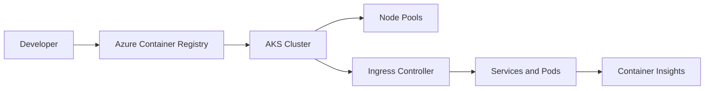

# ☸️ Azure Kubernetes Service

This Azure guide explains **☸️ Azure Kubernetes Service** as a practical Azure service topic: core concepts, how it works, deployment steps, security choices, operations, and best practices. Azure Kubernetes Service is a managed Kubernetes platform for running containerized workloads with Microsoft-managed control plane operations and Azure integrations.

---

## Table of Contents

1. Azure service overview
2. Core concepts
3. Hands-on getting started
4. Common architecture patterns
5. Security and operations best practices
6. Azure CLI quick commands
7. AWS-to-Azure terminology
8. Helpful links

---

## 1. Azure service overview

- **Azure service:** AKS, Azure CNI, Azure Policy, Container Insights
- **What it does:** Azure Kubernetes Service is a managed Kubernetes platform for running containerized workloads with Microsoft-managed control plane operations and Azure integrations.
- **AWS translation note:** Comparable AWS topic: Amazon EKS

## 2. Core concepts

- Managed control plane, node pools, cluster autoscaler, and automatic upgrades options
- Azure CNI networking, network policies, ingress controllers, and private clusters
- Integration with Azure Container Registry, managed identities, Key Vault, and Azure Monitor
- Azure Policy add-on, Defender for Containers, and workload identity

## 3. Hands-on getting started

1. Create a resource group and AKS cluster.
2. Connect kubectl and deploy a sample workload.
3. Configure ingress, certificates, secrets, and autoscaling.
4. Enable Container Insights, upgrades, backups, and policy controls.

## 4. Common architecture patterns

- **Beginner lab:** Deploy a small resource in a dedicated resource group, tag it, monitor it, and delete it after practice.
- **Production baseline:** Use separate subscriptions or resource groups for dev, test, and production; apply Azure Policy; deploy with infrastructure as code.
- **High availability:** Prefer availability zones or zone-redundant services when the region supports them.
- **Private access:** Use private endpoints, VNets, private DNS, and managed identities when the workload should not be exposed publicly.
- **Cost control:** Use budgets, alerts, reservations or savings plans where appropriate, and right-size resources continuously.

## 5. Security and operations best practices

- Use separate system and user node pools.
- Enable workload identity instead of long-lived Kubernetes secrets.
- Plan IP ranges carefully before production.
- Regularly upgrade Kubernetes versions and node images.

## 6. Azure CLI quick commands

```bash
# Login and select a subscription
az login
az account set --subscription "<subscription-id>"

# Create a resource group for practice
az group create --name rg-learning-azure --location eastus

# List resources in the group
az resource list --resource-group rg-learning-azure --output table

# Clean up practice resources when finished
az group delete --name rg-learning-azure --yes --no-wait
```

## 7. AWS-to-Azure terminology

| AWS term | Azure term |
|---|---|
| Account | Tenant + subscription |
| Region | Region |
| Availability Zone | Availability Zone |
| IAM policy | Azure RBAC role assignment / Azure Policy |
| Security Group | Network Security Group |
| VPC | Virtual Network |
| CloudWatch | Azure Monitor |
| CloudFormation | ARM template / Bicep |

## Azure-first deep dive

AKS provides a managed Kubernetes control plane and Azure-integrated worker node pools. Important design choices include Azure CNI vs overlay networking, private vs public cluster endpoint, node pool sizing, ingress controller, secrets model, workload identity, registry integration, and upgrade policy.

A strong AKS baseline enables Azure Monitor Container Insights, Microsoft Defender for Containers, workload identity, separate system/user node pools, cluster autoscaler, network policies, and a planned IP address range before cluster creation.

## 8. Helpful links

- [Microsoft Azure documentation](https://learn.microsoft.com/azure/)
- [Azure architecture center](https://learn.microsoft.com/azure/architecture/)
- [Azure well-architected framework](https://learn.microsoft.com/azure/well-architected/)
- [Azure CLI documentation](https://learn.microsoft.com/cli/azure/)

## Architecture workflow



Practical lab: build an image, push it to ACR, attach ACR to AKS, deploy a Kubernetes manifest, expose it through ingress, then review pod logs and Container Insights.
