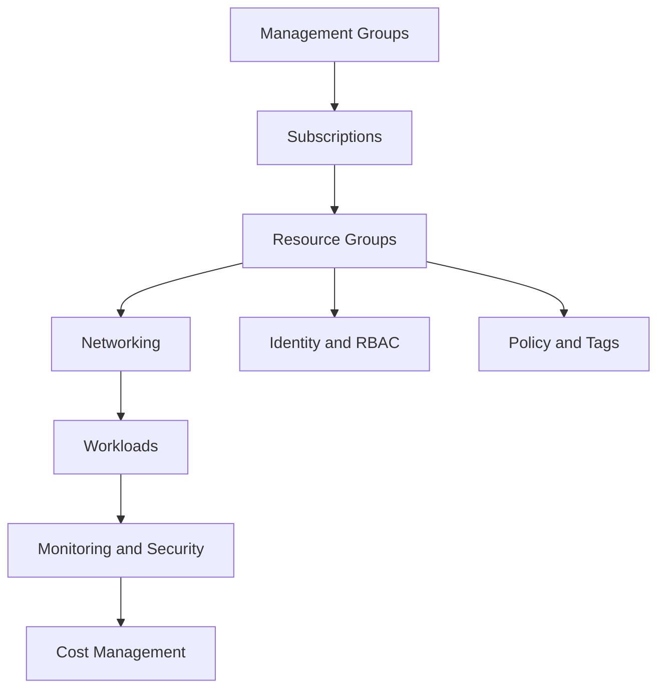
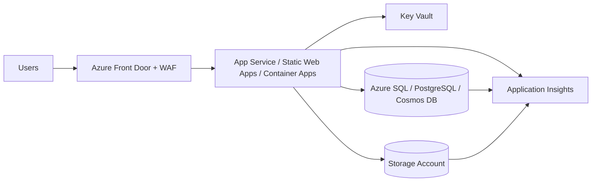
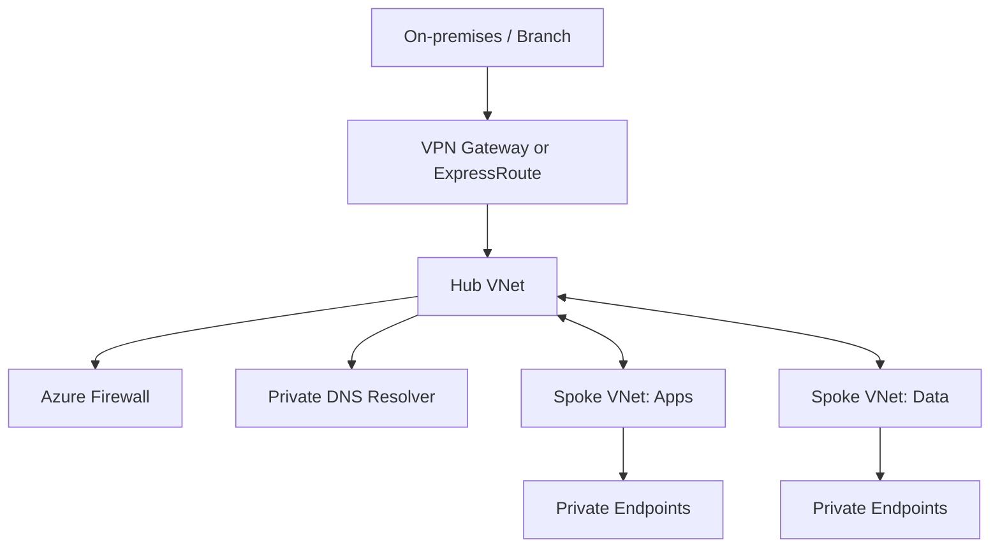
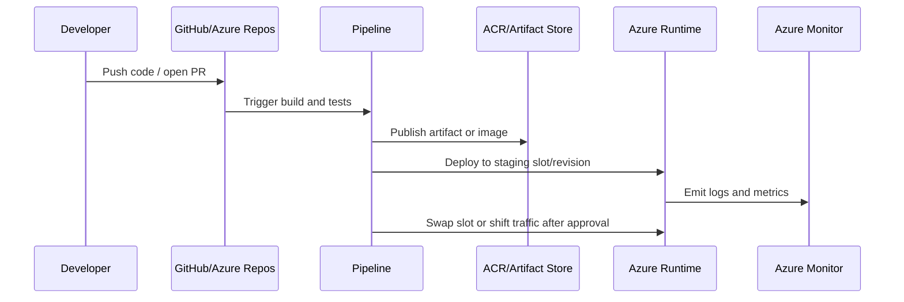
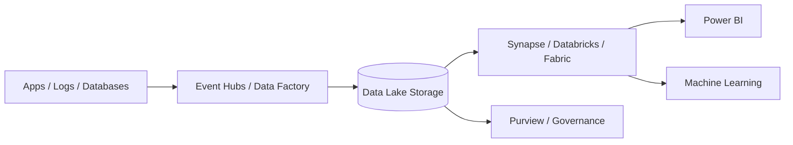

# 🧭 Azure Architecture and Workflow Playbook

This playbook adds visual architecture and practical workflow examples for the Azure notes. Use it as a quick reference when deciding how Azure services fit together.

## 1. Standard Azure landing zone workflow

Practical steps:

1. Create management groups for platform, connectivity, identity, and workloads.
2. Create separate subscriptions for production and non-production.
3. Apply Azure Policy for allowed locations, required tags, and security baselines.
4. Build hub-and-spoke networking before production workloads.
5. Route logs to Log Analytics and security events to Sentinel if required.

## 2. Secure web application architecture

Practical steps:

1. Put Azure Front Door in front of public web apps for TLS, global routing, caching, and WAF.
2. Use managed identity from the app to Key Vault and data services.
3. Use private endpoints for databases and storage where production security requires private access.
4. Enable Application Insights and create alerts for failures, latency, and availability.

## 3. Hub-and-spoke network architecture

Practical steps:

1. Keep shared connectivity, firewall, and DNS in the hub.
2. Put applications and data platforms in separate spokes.
3. Use VNet peering for hub-to-spoke communication.
4. Use Private DNS zones for Private Link resolution.
5. Use route tables to force egress through Azure Firewall when required.

## 4. CI/CD workflow for Azure apps

Practical steps:

1. Build once and promote the same artifact through environments.
2. Use workload identity federation for pipeline authentication.
3. Use deployment slots, Container Apps revisions, or AKS rollout strategies.
4. Add approvals and environment checks for production.
5. Roll back by swapping slots, reverting revisions, or redeploying the previous artifact.

## 5. Data and analytics workflow

Practical steps:

1. Ingest batch data with Data Factory and streaming data with Event Hubs.
2. Store raw, curated, and serving layers in Data Lake Storage.
3. Use Synapse serverless SQL or Spark for exploration and transformation.
4. Publish modeled data to Power BI or downstream apps.
5. Govern access, lineage, and classification with Purview when required.
