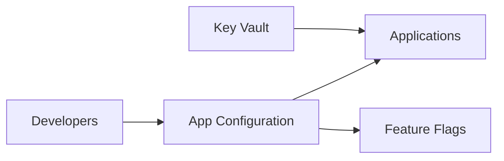

# ⚙️ Azure App Configuration

Azure App Configuration centralizes application settings and feature flags across distributed applications.

## Workflow

## Practical use cases

- Store non-secret settings outside application packages.
- Roll out feature flags by environment or user segment.
- Refresh configuration without redeploying code.
- Reference Key Vault for secrets while keeping config metadata centralized.

## Best practices

- Keep secrets in Key Vault, not App Configuration values.
- Use labels for environments such as `dev`, `test`, and `prod`.
- Apply RBAC and private endpoints for production.
- Version and review configuration changes like code.
