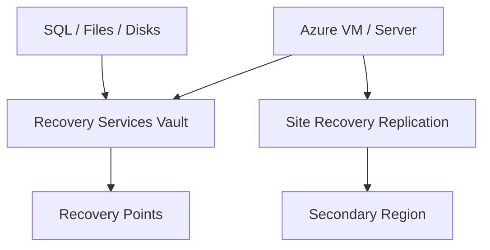

# ♻️ Azure Backup and Site Recovery

Azure Backup protects data and workloads. Azure Site Recovery provides disaster recovery replication and failover for VMs and servers.

## Architecture

## Practical workflow

1. Create a Recovery Services vault.
2. Define backup policy and retention.
3. Enable backup for VMs, disks, or supported workloads.
4. Run a test restore.
5. For disaster recovery, configure Site Recovery replication and test failover.

## Best practices

- Backups are only useful after restore testing.
- Use separate retention policies for short-term operational restore and long-term compliance.
- Protect the vault with soft delete, immutability where appropriate, and RBAC.
- Document RPO/RTO for each workload.
