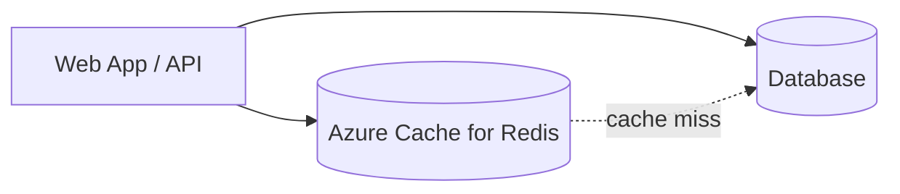

# ⚡ Azure Cache for Redis

Azure Cache for Redis is an in-memory cache used to improve application performance, reduce database load, and store short-lived session or lookup data.

## Architecture

## Practical patterns

- Cache-aside for database query results.
- Distributed session storage for web apps.
- Rate limiting counters and temporary tokens.
- Pub/sub for lightweight notifications.

## Best practices

- Set TTLs to prevent stale or unlimited cache growth.
- Plan for cache misses and Redis failover.
- Use private endpoints and TLS for production.
- Monitor memory pressure, evictions, server load, and latency.
