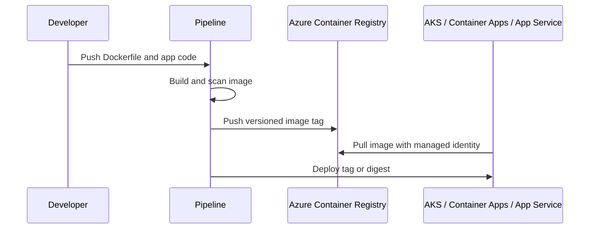

# 🐳 Azure Container Registry

Azure Container Registry stores private container images and OCI artifacts for AKS, Container Apps, App Service, and CI/CD pipelines.

## Workflow



## Practical commands

```bash
az acr create --name myregistrydemo --resource-group rg-containers --sku Basic
az acr login --name myregistrydemo
docker build -t myregistrydemo.azurecr.io/webapp:1.0.0 .
docker push myregistrydemo.azurecr.io/webapp:1.0.0
```

## Best practices

- Use managed identity or workload identity for image pulls.
- Use immutable version tags or image digests for production deployments.
- Enable private endpoints for restricted environments.
- Clean up old tags with retention policies or automation.
