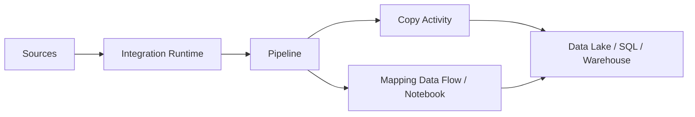

# 🏭 Azure Data Factory

Azure Data Factory orchestrates data movement and transformation pipelines across cloud, on-premises, SaaS, and data lake systems.

## Architecture

## Practical workflow

1. Create linked services for source and destination.
2. Create datasets that represent files, tables, or objects.
3. Build a pipeline with copy, transform, validation, and notification activities.
4. Trigger on schedule, event, or manual run.
5. Monitor pipeline runs and failures.

## Best practices

- Use self-hosted integration runtime for private/on-premises sources.
- Parameterize pipelines for reusable ingestion patterns.
- Store secrets in Key Vault.
- Use incremental loads instead of full reloads when possible.
