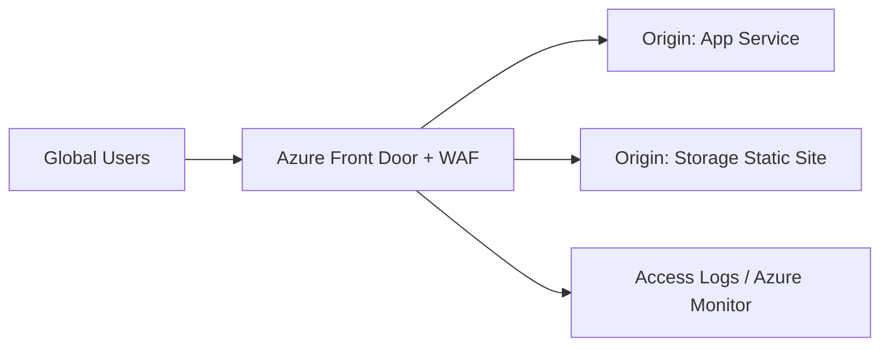

# 🚀 Azure Front Door and Azure CDN

This Azure guide explains **🚀 Azure Front Door and Azure CDN** as a practical Azure service topic: core concepts, how it works, deployment steps, security choices, operations, and best practices. Azure Front Door and Azure CDN accelerate web content, route traffic globally, terminate TLS, cache static assets, and protect applications with web application firewall capabilities.

---

## Table of Contents

1. Azure service overview
2. Core concepts
3. Hands-on getting started
4. Common architecture patterns
5. Security and operations best practices
6. Azure CLI quick commands
7. AWS-to-Azure terminology
8. Helpful links

---

## 1. Azure service overview

- **Azure service:** Azure Front Door, Azure CDN, WAF
- **What it does:** Azure Front Door and Azure CDN accelerate web content, route traffic globally, terminate TLS, cache static assets, and protect applications with web application firewall capabilities.
- **AWS translation note:** Comparable AWS topic: Amazon CloudFront

## 2. Core concepts

- Global HTTP load balancing and acceleration
- Path-based routing, custom domains, managed certificates, and origin groups
- WAF managed rules, bot protection, and custom rules
- Caching, compression, rules engine, and origin shielding patterns

## 3. Hands-on getting started

1. Create an endpoint and origin group.
2. Add origins such as App Service, Storage static website, AKS ingress, or custom hosts.
3. Configure routes, caching, custom domain, and TLS.
4. Enable WAF policy for public web apps.

## 4. Common architecture patterns

- **Beginner lab:** Deploy a small resource in a dedicated resource group, tag it, monitor it, and delete it after practice.
- **Production baseline:** Use separate subscriptions or resource groups for dev, test, and production; apply Azure Policy; deploy with infrastructure as code.
- **High availability:** Prefer availability zones or zone-redundant services when the region supports them.
- **Private access:** Use private endpoints, VNets, private DNS, and managed identities when the workload should not be exposed publicly.
- **Cost control:** Use budgets, alerts, reservations or savings plans where appropriate, and right-size resources continuously.

## 5. Security and operations best practices

- Use health probes and multiple origins for resilience.
- Enable WAF in prevention mode after testing.
- Cache static assets aggressively with versioned file names.
- Protect origins so traffic comes through Front Door where possible.

## 6. Azure CLI quick commands

```bash
# Login and select a subscription
az login
az account set --subscription "<subscription-id>"

# Create a resource group for practice
az group create --name rg-learning-azure --location eastus

# List resources in the group
az resource list --resource-group rg-learning-azure --output table

# Clean up practice resources when finished
az group delete --name rg-learning-azure --yes --no-wait
```

## 7. AWS-to-Azure terminology

| AWS term | Azure term |
|---|---|
| Account | Tenant + subscription |
| Region | Region |
| Availability Zone | Availability Zone |
| IAM policy | Azure RBAC role assignment / Azure Policy |
| Security Group | Network Security Group |
| VPC | Virtual Network |
| CloudWatch | Azure Monitor |
| CloudFormation | ARM template / Bicep |

## Azure-first deep dive

Azure Front Door is a global HTTP/S entry point with routing, acceleration, TLS, WAF, and origin failover. It is commonly placed in front of App Service, AKS ingress, Storage static sites, or custom origins. Azure CDN focuses on caching static content.

Production designs should use custom domains, managed certificates, WAF managed rules, origin health probes, caching rules, compression, and origin access restrictions so users cannot bypass the edge layer.

## 8. Helpful links

- [Microsoft Azure documentation](https://learn.microsoft.com/azure/)
- [Azure architecture center](https://learn.microsoft.com/azure/architecture/)
- [Azure well-architected framework](https://learn.microsoft.com/azure/well-architected/)
- [Azure CLI documentation](https://learn.microsoft.com/cli/azure/)

## Practical architecture diagram



Practical lab: create Front Door, add two origins, configure a route and WAF policy, enable caching for static assets, and test origin failover.
