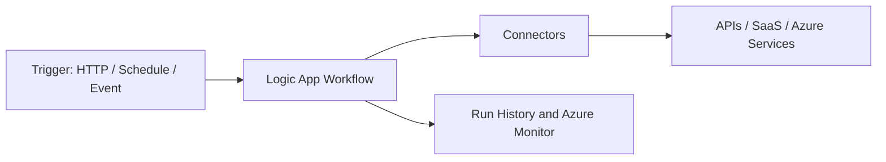

# 🔄 Azure Logic Apps

Azure Logic Apps builds low-code workflows that connect SaaS apps, Azure services, APIs, files, messages, and approvals.

## Architecture

## Practical workflow examples

- When a Service Bus message arrives, transform it and call an API.
- When a file lands in Storage, validate it and send an approval email.
- When Sentinel creates an incident, enrich it and notify Teams.

## Best practices

- Use managed identities where connectors support them.
- Keep workflows modular and observable.
- Handle retries, timeout, and failure paths explicitly.
- Use Standard Logic Apps for complex enterprise workflows and VNet needs.
