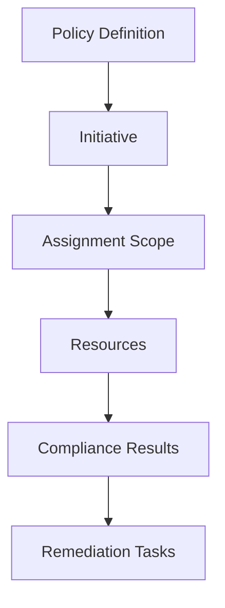

# 🛡️ Azure Policy and Governance

Azure Policy enforces rules and guardrails across subscriptions and resource groups. It can audit, deny, append, modify, or deploy configuration automatically.

## How it works



## Practical use cases

- Require tags like `owner`, `environment`, and `costCenter`.
- Restrict allowed Azure regions.
- Deny public IP creation in locked-down subscriptions.
- Enforce diagnostic settings to Log Analytics.
- Deploy Defender plans or monitoring agents automatically.

## Beginner workflow

```bash
az policy definition list --query "[?policyType=='BuiltIn'].[displayName,name]" --output table
az policy assignment list --output table
```

## Best practices

- Assign policies at management group scope for consistent governance.
- Start in audit mode, review impact, then move to deny or deploy-if-not-exists.
- Use initiatives for grouped standards such as security baseline or tagging baseline.
- Exempt resources only with documented approval and expiry.
