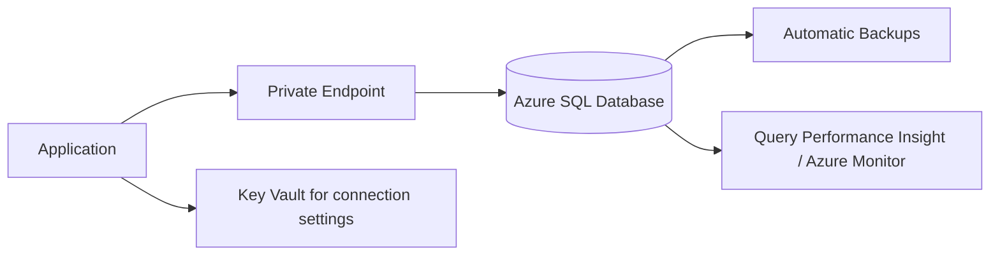

# 🛢️ Azure SQL Database and Managed Databases

This Azure guide explains **🛢️ Azure SQL Database and Managed Databases** as a practical Azure service topic: core concepts, how it works, deployment steps, security choices, operations, and best practices. Azure managed database services reduce operational work for relational databases by handling patching, backups, high availability, scaling, and monitoring.

---

## Table of Contents

1. Azure service overview
2. Core concepts
3. Hands-on getting started
4. Common architecture patterns
5. Security and operations best practices
6. Azure CLI quick commands
7. AWS-to-Azure terminology
8. Helpful links

---

## 1. Azure service overview

- **Azure service:** Azure SQL Database, SQL Managed Instance, Azure Database for PostgreSQL, Azure Database for MySQL
- **What it does:** Azure managed database services reduce operational work for relational databases by handling patching, backups, high availability, scaling, and monitoring.
- **AWS translation note:** Comparable AWS topic: Amazon RDS

## 2. Core concepts

- Azure SQL Database single database, elastic pool, serverless, and hyperscale options
- SQL Managed Instance for broader SQL Server compatibility
- Managed PostgreSQL and MySQL flexible server options
- Automated backups, point-in-time restore, replicas, private access, and encryption

## 3. Hands-on getting started

1. Choose engine and deployment model.
2. Create server, database, admin, networking, and firewall or private endpoint settings.
3. Load schema and data.
4. Configure backups, alerts, performance tuning, and maintenance windows.

## 4. Common architecture patterns

- **Beginner lab:** Deploy a small resource in a dedicated resource group, tag it, monitor it, and delete it after practice.
- **Production baseline:** Use separate subscriptions or resource groups for dev, test, and production; apply Azure Policy; deploy with infrastructure as code.
- **High availability:** Prefer availability zones or zone-redundant services when the region supports them.
- **Private access:** Use private endpoints, VNets, private DNS, and managed identities when the workload should not be exposed publicly.
- **Cost control:** Use budgets, alerts, reservations or savings plans where appropriate, and right-size resources continuously.

## 5. Security and operations best practices

- Use private endpoints for production databases.
- Enable Microsoft Entra authentication when supported.
- Set backup retention based on recovery requirements.
- Monitor query performance, DTU/vCore usage, deadlocks, and storage growth.

## 6. Azure CLI quick commands

```bash
# Login and select a subscription
az login
az account set --subscription "<subscription-id>"

# Create a resource group for practice
az group create --name rg-learning-azure --location eastus

# List resources in the group
az resource list --resource-group rg-learning-azure --output table

# Clean up practice resources when finished
az group delete --name rg-learning-azure --yes --no-wait
```

## 7. AWS-to-Azure terminology

| AWS term | Azure term |
|---|---|
| Account | Tenant + subscription |
| Region | Region |
| Availability Zone | Availability Zone |
| IAM policy | Azure RBAC role assignment / Azure Policy |
| Security Group | Network Security Group |
| VPC | Virtual Network |
| CloudWatch | Azure Monitor |
| CloudFormation | ARM template / Bicep |

## Azure-first deep dive

Azure SQL Database is a managed SQL platform with automatic backups, patching, high availability, point-in-time restore, performance tuning, and scaling choices. Choose single database for isolated apps, elastic pools for many variable databases, Hyperscale for very large databases, and Managed Instance when SQL Server compatibility is a priority.

Secure production databases with Microsoft Entra authentication, private endpoints, least-privilege database users, auditing, threat detection, and tested restore procedures.

## 8. Helpful links

- [Microsoft Azure documentation](https://learn.microsoft.com/azure/)
- [Azure architecture center](https://learn.microsoft.com/azure/architecture/)
- [Azure well-architected framework](https://learn.microsoft.com/azure/well-architected/)
- [Azure CLI documentation](https://learn.microsoft.com/cli/azure/)

## Architecture workflow



Practical lab: create a database, configure firewall or private endpoint, create a least-privilege user, load sample data, enable auditing, and test point-in-time restore.
