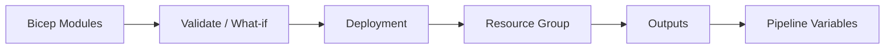

# 🏗️ Azure Infrastructure as Code with Bicep, ARM, and Terraform

This Azure guide explains **🏗️ Azure Infrastructure as Code with Bicep, ARM, and Terraform** as a practical Azure service topic: core concepts, how it works, deployment steps, security choices, operations, and best practices. Azure infrastructure as code can be managed with Bicep, ARM templates, Terraform, or Azure Verified Modules to create repeatable, reviewable, version-controlled deployments.

---

## Table of Contents

1. Azure service overview
2. Core concepts
3. Hands-on getting started
4. Common architecture patterns
5. Security and operations best practices
6. Azure CLI quick commands
7. AWS-to-Azure terminology
8. Helpful links

---

## 1. Azure service overview

- **Azure service:** Bicep, ARM templates, Terraform azurerm provider
- **What it does:** Azure infrastructure as code can be managed with Bicep, ARM templates, Terraform, or Azure Verified Modules to create repeatable, reviewable, version-controlled deployments.
- **AWS translation note:** Comparable AWS topic: AWS CloudFormation and Terraform

## 2. Core concepts

- Bicep provides a concise Azure-native language compiled to ARM templates
- ARM templates are the native deployment engine format
- Terraform azurerm provider supports multi-cloud workflows and Azure resource management
- What-if deployments, policy checks, modules, and CI/CD automation

## 3. Hands-on getting started

1. Choose Bicep or Terraform based on team standards.
2. Define resource groups, network, identity, compute, and data resources as code.
3. Validate, plan/what-if, and deploy through a pipeline.
4. Store state securely when using Terraform.

## 4. Common architecture patterns

- **Beginner lab:** Deploy a small resource in a dedicated resource group, tag it, monitor it, and delete it after practice.
- **Production baseline:** Use separate subscriptions or resource groups for dev, test, and production; apply Azure Policy; deploy with infrastructure as code.
- **High availability:** Prefer availability zones or zone-redundant services when the region supports them.
- **Private access:** Use private endpoints, VNets, private DNS, and managed identities when the workload should not be exposed publicly.
- **Cost control:** Use budgets, alerts, reservations or savings plans where appropriate, and right-size resources continuously.

## 5. Security and operations best practices

- Use modules and consistent naming conventions.
- Review plans before applying changes.
- Keep secrets out of templates and state.
- Tag resources and enforce guardrails with Azure Policy.

## 6. Azure CLI quick commands

```bash
# Login and select a subscription
az login
az account set --subscription "<subscription-id>"

# Create a resource group for practice
az group create --name rg-learning-azure --location eastus

# List resources in the group
az resource list --resource-group rg-learning-azure --output table

# Clean up practice resources when finished
az group delete --name rg-learning-azure --yes --no-wait
```

## 7. AWS-to-Azure terminology

| AWS term | Azure term |
|---|---|
| Account | Tenant + subscription |
| Region | Region |
| Availability Zone | Availability Zone |
| IAM policy | Azure RBAC role assignment / Azure Policy |
| Security Group | Network Security Group |
| VPC | Virtual Network |
| CloudWatch | Azure Monitor |
| CloudFormation | ARM template / Bicep |

## Azure-first deep dive

Bicep is the recommended Azure-native IaC language for ARM deployments. It supports modules, parameters, outputs, existing resources, and what-if previews. Terraform is also common when teams need a multi-cloud workflow. Good IaC separates reusable modules from environment parameter files and runs validation in CI before deployment.

Never hard-code secrets in templates. Use Key Vault, secure parameters, managed identities, and policy checks. For Terraform, secure remote state and restrict access to state files.

## 8. Helpful links

- [Microsoft Azure documentation](https://learn.microsoft.com/azure/)
- [Azure architecture center](https://learn.microsoft.com/azure/architecture/)
- [Azure well-architected framework](https://learn.microsoft.com/azure/well-architected/)
- [Azure CLI documentation](https://learn.microsoft.com/cli/azure/)

## Architecture workflow



Practical lab: create a Bicep file for a storage account, run `az deployment group what-if`, deploy it, output the endpoint, and add the deployment to CI.
