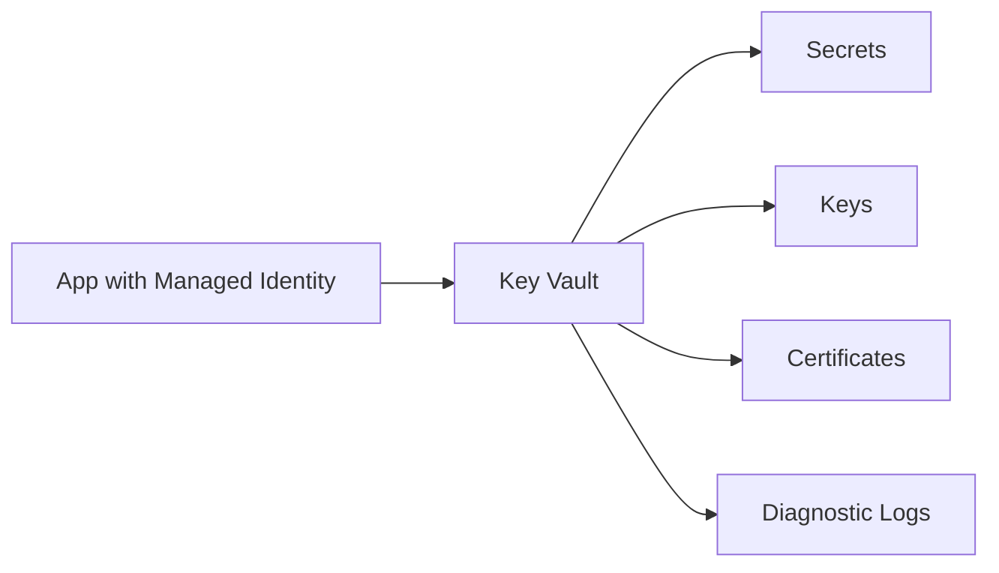

# 🔑 Azure Key Vault

Azure Key Vault is an Azure-native service for managing secrets, keys, and certificates. It adds an Azure-specific security topic that complements the AWS notes.

## Core features

- Secrets for passwords, tokens, and connection strings.
- Keys backed by software or hardware security modules depending on tier.
- Certificate import, issuance integration, rotation, and lifecycle management.
- RBAC or access policy authorization models.
- Private endpoints, firewall rules, diagnostic logs, and purge protection.

## Getting started

1. Create a vault with soft delete and purge protection.
2. Assign RBAC permissions to users, groups, and managed identities.
3. Store application secrets and certificates.
4. Reference secrets from App Service, Functions, pipelines, or code through SDKs.
5. Enable diagnostic logs and alerts for critical operations.

## Best practices

- Use managed identities instead of application secrets wherever possible.
- Enable purge protection for production vaults.
- Use private endpoints for sensitive workloads.
- Rotate secrets and certificates on a defined schedule.

## Azure-first deep dive

Key Vault stores secrets, cryptographic keys, and certificates behind Azure RBAC or vault access policies. Applications should access Key Vault using managed identity, not hard-coded client secrets. Soft delete and purge protection protect against accidental or malicious deletion. Diagnostic logs record secret reads, writes, and administrative operations.

Use separate vaults by environment or application boundary, enable private endpoints for sensitive workloads, and automate certificate/secret rotation.

## Practical architecture diagram

Practical lab: create a vault, enable purge protection, add a secret, enable managed identity on an app, grant RBAC access, and read the secret without storing credentials.
