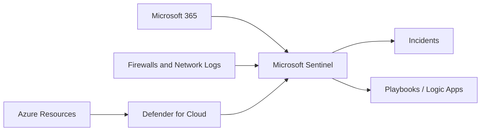

# 🛡️ Microsoft Defender for Cloud and Microsoft Sentinel

Defender for Cloud improves cloud security posture and workload protection. Microsoft Sentinel is a cloud-native SIEM/SOAR platform for security analytics and incident response.

## Architecture

## Practical workflow

1. Enable Defender for Cloud recommendations for subscriptions.
2. Turn on workload protection plans where needed.
3. Send security logs to a Log Analytics workspace.
4. Connect Sentinel data connectors.
5. Create analytics rules and automation playbooks.
6. Review incidents and tune noisy detections.

## Best practices

- Start with security posture recommendations before enabling every paid plan.
- Route critical identity, network, and workload logs to Sentinel.
- Use automation rules for enrichment and notification.
- Track secure score trends and assign remediation owners.
