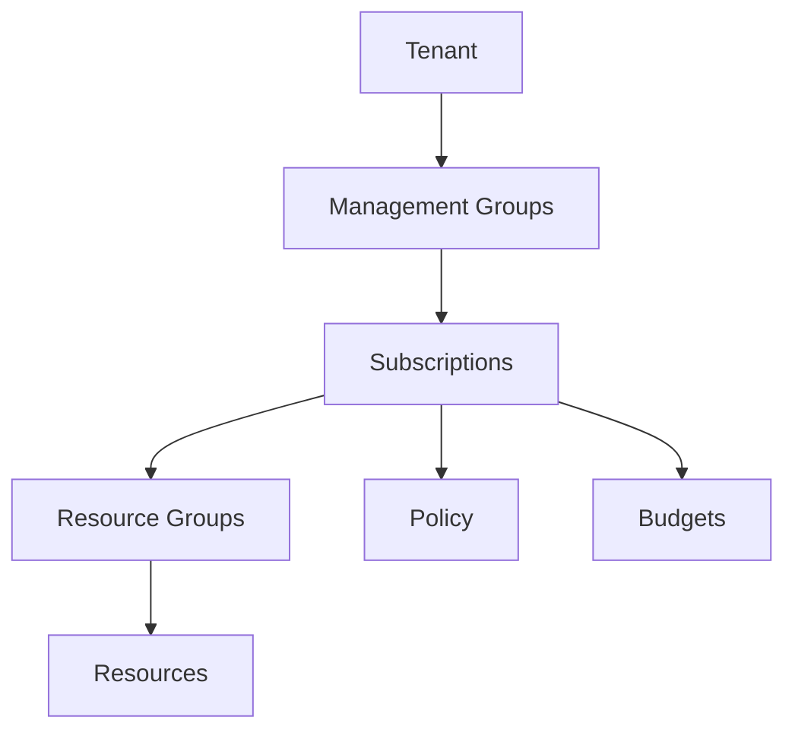

# ☁️ Introduction to Microsoft Azure

This Azure guide explains **☁️ Introduction to Microsoft Azure** as a practical Azure service topic: core concepts, how it works, deployment steps, security choices, operations, and best practices. Microsoft Azure is a cloud platform for building, deploying, and operating applications across Microsoft-managed datacenters, edge locations, hybrid environments, and partner ecosystems.

---

## Table of Contents

1. Azure service overview
2. Core concepts
3. Hands-on getting started
4. Common architecture patterns
5. Security and operations best practices
6. Azure CLI quick commands
7. AWS-to-Azure terminology
8. Helpful links

---

## 1. Azure service overview

- **Azure service:** Azure global cloud platform
- **What it does:** Microsoft Azure is a cloud platform for building, deploying, and operating applications across Microsoft-managed datacenters, edge locations, hybrid environments, and partner ecosystems.
- **AWS translation note:** Comparable AWS topic: AWS overview / cloud computing

## 2. Core concepts

- Global regions, region pairs, availability zones, and sovereign cloud options
- Deep integration with Microsoft Entra ID, Microsoft 365, GitHub, Visual Studio, and Windows/Linux ecosystems
- Compute, storage, networking, databases, analytics, AI, DevOps, IoT, and security services
- Hybrid-first services such as Azure Arc, Azure Stack HCI, ExpressRoute, and Azure VMware Solution

## 3. Hands-on getting started

1. Create an Azure account and subscription.
2. Organize work with management groups, subscriptions, resource groups, and tags.
3. Select a region and availability strategy.
4. Deploy a small workload, monitor it, and review costs in Microsoft Cost Management.

## 4. Common architecture patterns

- **Beginner lab:** Deploy a small resource in a dedicated resource group, tag it, monitor it, and delete it after practice.
- **Production baseline:** Use separate subscriptions or resource groups for dev, test, and production; apply Azure Policy; deploy with infrastructure as code.
- **High availability:** Prefer availability zones or zone-redundant services when the region supports them.
- **Private access:** Use private endpoints, VNets, private DNS, and managed identities when the workload should not be exposed publicly.
- **Cost control:** Use budgets, alerts, reservations or savings plans where appropriate, and right-size resources continuously.

## 5. Security and operations best practices

- Use management groups and Azure Policy before large-scale deployments.
- Enable Microsoft Defender for Cloud recommendations.
- Use resource groups and tags for ownership and cost tracking.
- Prefer infrastructure as code through Bicep, ARM, Terraform, or Azure Verified Modules.

## 6. Azure CLI quick commands

```bash
# Login and select a subscription
az login
az account set --subscription "<subscription-id>"

# Create a resource group for practice
az group create --name rg-learning-azure --location eastus

# List resources in the group
az resource list --resource-group rg-learning-azure --output table

# Clean up practice resources when finished
az group delete --name rg-learning-azure --yes --no-wait
```

## 7. AWS-to-Azure terminology

| AWS term | Azure term |
|---|---|
| Account | Tenant + subscription |
| Region | Region |
| Availability Zone | Availability Zone |
| IAM policy | Azure RBAC role assignment / Azure Policy |
| Security Group | Network Security Group |
| VPC | Virtual Network |
| CloudWatch | Azure Monitor |
| CloudFormation | ARM template / Bicep |

## Azure-first deep dive

Azure is organized through a hierarchy: tenant, management groups, subscriptions, resource groups, and resources. The tenant stores identities. Subscriptions define billing and access boundaries. Resource groups organize lifecycle and permissions for related resources. Regions and availability zones define physical placement.

Before building, decide naming standards, regions, tags, RBAC groups, budgets, policies, and logging. A clean foundation prevents messy subscriptions and insecure one-off resources later.

## 8. Helpful links

- [Microsoft Azure documentation](https://learn.microsoft.com/azure/)
- [Azure architecture center](https://learn.microsoft.com/azure/architecture/)
- [Azure well-architected framework](https://learn.microsoft.com/azure/well-architected/)
- [Azure CLI documentation](https://learn.microsoft.com/cli/azure/)

## Practical architecture diagram



Practical lab: create a resource group, apply tags, deploy a storage account, review the activity log, create a budget, and clean up the resource group.
