# 🧩 Azure Service Architecture Diagrams and Practical Labs

This supplemental guide avoids touching the Azure service README files that already exist on `main`, while still adding the missing diagrams, workflows, and hands-on practice requested for the Azure section.

## AKS application delivery

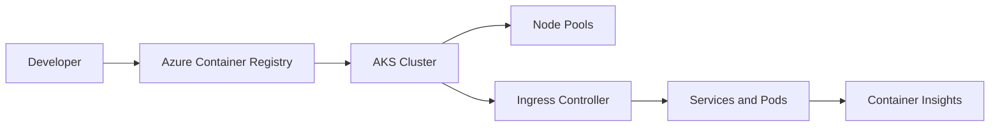

Practical lab: build an image, push it to ACR, attach ACR to AKS, deploy a Kubernetes manifest, expose it through ingress, and review pod logs in Container Insights.

## Static Web Apps and App Service delivery

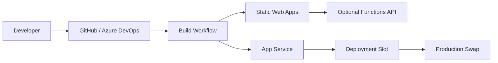

Practical lab: deploy a Vite or React app to Static Web Apps, deploy a Node/Python/.NET backend to App Service, configure app settings, add a custom domain, and test a staging-slot swap.

## Azure Functions event processing

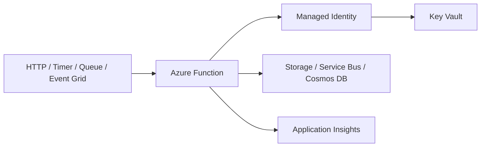

Practical lab: create an HTTP-triggered function, add a queue trigger, store a secret in Key Vault, enable managed identity, and inspect traces in Application Insights.

## Virtual Network hub-and-spoke

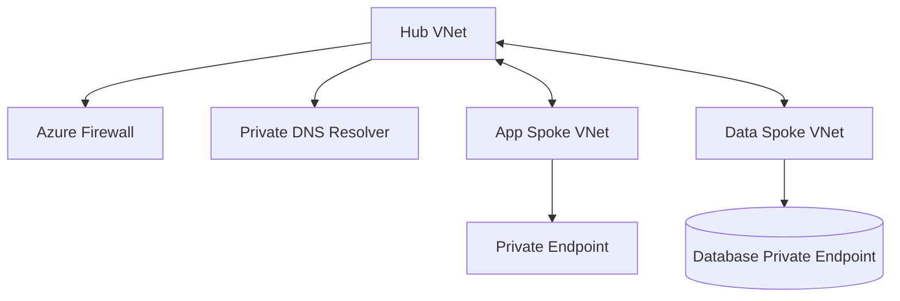

Practical lab: create hub and spoke VNets, configure peering, add private DNS zones, create a private endpoint, and verify private name resolution from a test VM.

## Storage account secure access

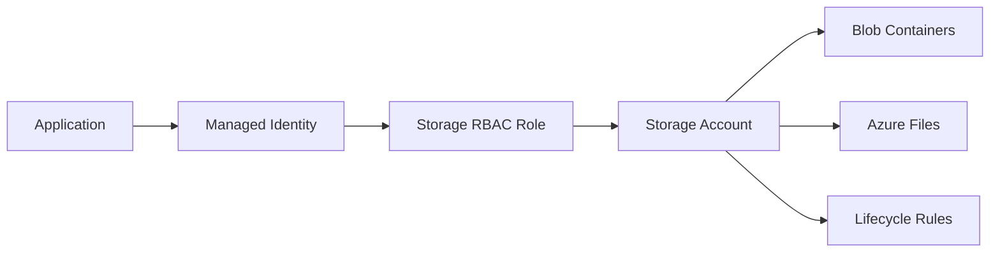

Practical lab: upload a file to Blob Storage, enable soft delete and versioning, add a lifecycle rule, disable public access, and validate managed-identity access.

## Azure SQL private application pattern

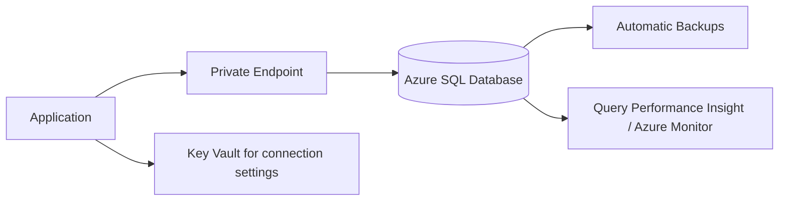

Practical lab: create a database, configure private endpoint or firewall access, create a least-privilege user, enable auditing, and test point-in-time restore.

## Cosmos DB partition and throughput workflow

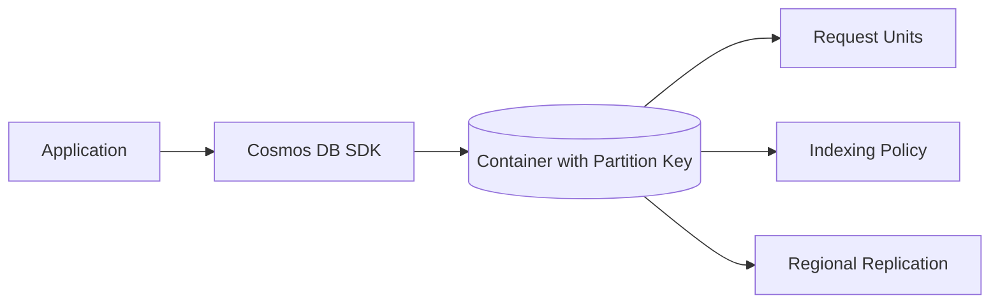

Practical lab: create a NoSQL account, choose a partition key, insert sample documents, query by partition key, review RU charge, and add autoscale throughput.

## Azure Monitor observability pipeline

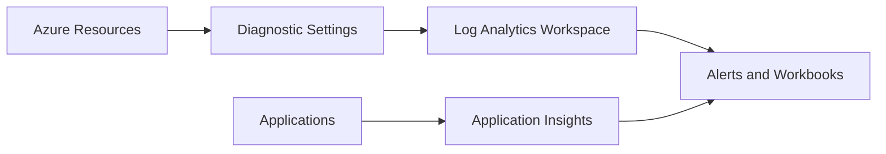

Practical lab: enable diagnostic settings, send logs to Log Analytics, run a KQL query, create an alert rule, and build a workbook chart.

## Azure DevOps CI/CD workflow

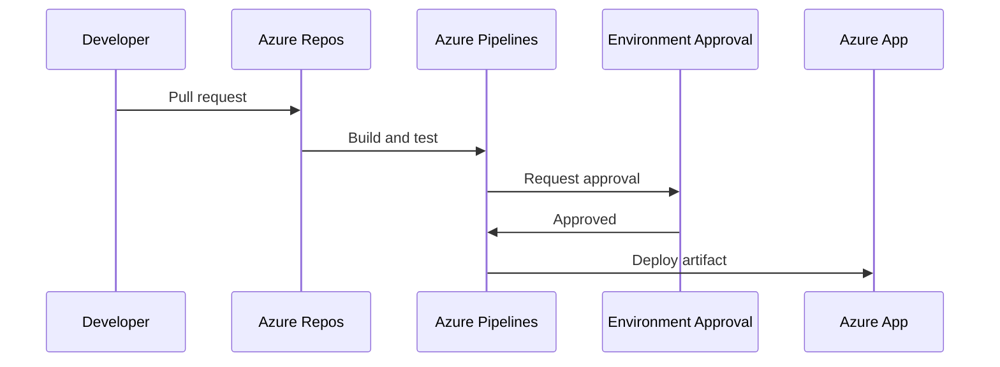

Practical lab: create a YAML pipeline, build an artifact, publish it, deploy to dev, add approval, and promote the same artifact to production.

## API Management gateway pattern

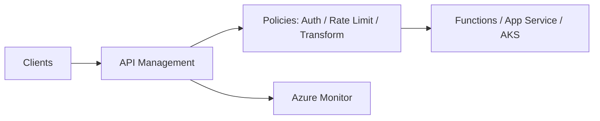

Practical lab: import an OpenAPI spec, add JWT validation, set a rate-limit policy, publish the API in a product, and review request metrics.

## Load balancing and autoscale

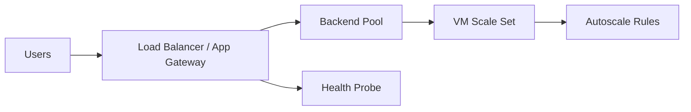

Practical lab: create a VM Scale Set, place it behind a load balancer, configure health probes, add CPU autoscale, and test scale-out.

## Messaging patterns

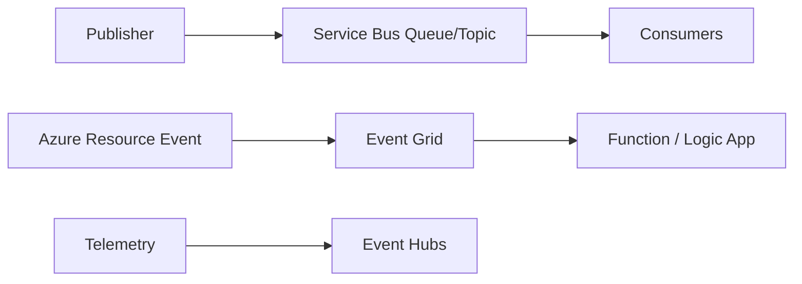

Practical lab: create a Service Bus queue, send messages, process them with a Function, test dead-letter behavior, and compare the same event flow with Event Grid.
