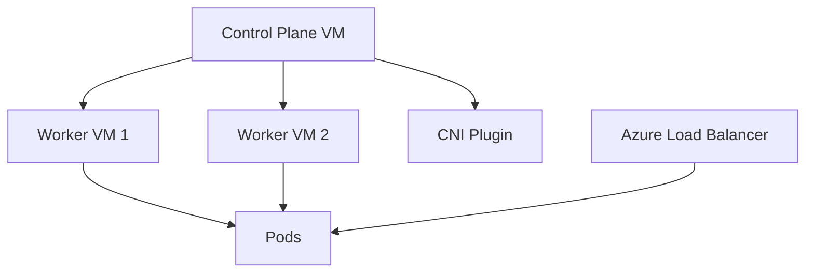

# ☸️ Setting Up Kubernetes Master and Worker Nodes on Azure VMs

AKS is recommended for most Azure Kubernetes workloads, but learning a self-managed Kubernetes cluster on Azure Virtual Machines is useful for understanding Kubernetes internals.

## Lab architecture

- One control-plane VM in an Azure Virtual Network.
- One or more worker VMs in the same subnet or peered subnet.
- Network Security Group allowing only required SSH and Kubernetes node traffic from trusted sources.
- Optional Azure Load Balancer for exposing test workloads.

## High-level setup

1. Create a resource group, VNet, subnet, and NSG.
2. Create Ubuntu VMs for control plane and workers.
3. Install container runtime, kubeadm, kubelet, and kubectl.
4. Initialize the control plane with kubeadm.
5. Install a CNI plugin.
6. Join worker nodes with the kubeadm join command.
7. Deploy a test application and expose it through a service.

## Azure-specific notes

- Prefer Azure Bastion instead of exposing SSH to the internet.
- Use managed disks and snapshots for VM protection during labs.
- Do not use self-managed clusters for production unless you have a clear operational requirement.
- For production, evaluate AKS with Azure CNI, workload identity, Azure Monitor, and Defender for Containers.

## Azure-first deep dive

A self-managed Kubernetes cluster on Azure VMs teaches control plane, kubelet, CNI, container runtime, and node communication. However, you own upgrades, backups, etcd health, certificates, security hardening, and node patching.

Use this only as a learning lab unless there is a strong production reason. For production, AKS removes much of the control-plane operations burden and integrates directly with Azure Monitor, Azure CNI, managed identities, Key Vault, Defender, and autoscaling.

## Practical architecture diagram

Practical lab: create three Ubuntu VMs, initialize kubeadm on the control plane, join workers, install CNI, deploy NGINX, and expose it with a service.
