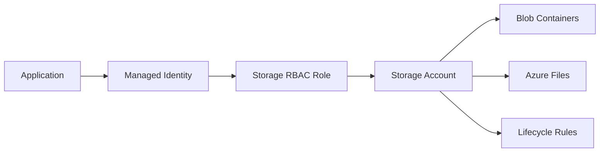

# 🗄️ Azure Storage Accounts and Blob Storage

This Azure guide explains **🗄️ Azure Storage Accounts and Blob Storage** as a practical Azure service topic: core concepts, how it works, deployment steps, security choices, operations, and best practices. Azure Storage provides durable object, file, queue, and table storage for static websites, backups, logs, data lakes, and application assets.

---

## Table of Contents

1. Azure service overview
2. Core concepts
3. Hands-on getting started
4. Common architecture patterns
5. Security and operations best practices
6. Azure CLI quick commands
7. AWS-to-Azure terminology
8. Helpful links

---

## 1. Azure service overview

- **Azure service:** Azure Blob Storage, Data Lake Storage, Files, Queues, Tables
- **What it does:** Azure Storage provides durable object, file, queue, and table storage for static websites, backups, logs, data lakes, and application assets.
- **AWS translation note:** Comparable AWS topic: Amazon S3

## 2. Core concepts

- Blob tiers: hot, cool, cold, and archive for lifecycle optimization
- Redundancy choices such as LRS, ZRS, GRS, GZRS, RA-GRS, and RA-GZRS
- Static website hosting, lifecycle management, immutability, versioning, and soft delete
- Azure Files SMB/NFS shares and AD-integrated file services

## 3. Hands-on getting started

1. Create a storage account with the correct performance and redundancy option.
2. Create containers or file shares.
3. Upload data using portal, Azure CLI, AzCopy, SDKs, or Storage Explorer.
4. Apply lifecycle rules, access policies, and monitoring.

## 4. Common architecture patterns

- **Beginner lab:** Deploy a small resource in a dedicated resource group, tag it, monitor it, and delete it after practice.
- **Production baseline:** Use separate subscriptions or resource groups for dev, test, and production; apply Azure Policy; deploy with infrastructure as code.
- **High availability:** Prefer availability zones or zone-redundant services when the region supports them.
- **Private access:** Use private endpoints, VNets, private DNS, and managed identities when the workload should not be exposed publicly.
- **Cost control:** Use budgets, alerts, reservations or savings plans where appropriate, and right-size resources continuously.

## 5. Security and operations best practices

- Disable public blob access unless explicitly required.
- Use Microsoft Entra ID and managed identities where possible.
- Enable soft delete, versioning, and immutable storage for critical data.
- Use private endpoints for private workloads.

## 6. Azure CLI quick commands

```bash
# Login and select a subscription
az login
az account set --subscription "<subscription-id>"

# Create a resource group for practice
az group create --name rg-learning-azure --location eastus

# List resources in the group
az resource list --resource-group rg-learning-azure --output table

# Clean up practice resources when finished
az group delete --name rg-learning-azure --yes --no-wait
```

## 7. AWS-to-Azure terminology

| AWS term | Azure term |
|---|---|
| Account | Tenant + subscription |
| Region | Region |
| Availability Zone | Availability Zone |
| IAM policy | Azure RBAC role assignment / Azure Policy |
| Security Group | Network Security Group |
| VPC | Virtual Network |
| CloudWatch | Azure Monitor |
| CloudFormation | ARM template / Bicep |

## Azure-first deep dive

A storage account is the namespace and security boundary for Blob, Files, Queues, and Tables. Before creating one, choose redundancy, performance tier, access model, network access, and data protection settings. Blob containers hold objects, Azure Files provides SMB/NFS shares, Queues support simple message processing, and Tables provide key-value NoSQL storage.

For production, disable anonymous access unless required, enable soft delete and versioning, use lifecycle rules for tiering, prefer private endpoints, and use Microsoft Entra ID RBAC instead of shared keys where possible.

## 8. Helpful links

- [Microsoft Azure documentation](https://learn.microsoft.com/azure/)
- [Azure architecture center](https://learn.microsoft.com/azure/architecture/)
- [Azure well-architected framework](https://learn.microsoft.com/azure/well-architected/)
- [Azure CLI documentation](https://learn.microsoft.com/cli/azure/)

## Architecture workflow



Practical lab: create a storage account, create a private container, upload a file with AzCopy or CLI, enable soft delete/versioning, add a lifecycle rule, and test RBAC access.
