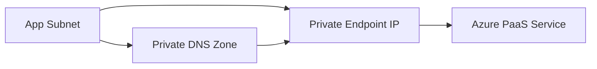

# 🔒 Azure Private Endpoints

Azure Private Endpoint maps a private IP address from your VNet to a supported Azure PaaS service. It is the Azure pattern most similar to private AWS service connectivity with VPC endpoints.

## Use cases

- Keep Storage, SQL, Key Vault, Cosmos DB, Container Registry, and other PaaS services off the public internet.
- Enforce private access for production applications.
- Combine with private DNS zones so applications use normal service names while resolving to private IPs.

## Implementation checklist

1. Create or choose a VNet and subnet.
2. Create the target PaaS resource.
3. Add a private endpoint for the required subresource.
4. Configure private DNS zone integration.
5. Disable public network access when validation is complete.
6. Test from a VM, Function, App Service, AKS pod, or other workload inside the network.

## Best practices

- Use separate private DNS zones for each service namespace.
- Avoid manually overriding DNS unless you understand the full resolution path.
- Validate access before disabling public network access.
- Monitor denied connections and DNS resolution failures during migrations.

## Practical architecture diagram

Practical lab: create a Storage account private endpoint, link the private DNS zone, disable public access, and verify access from a VM in the VNet.
