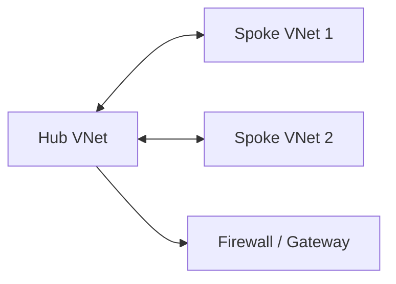

# 🔗 Azure VNet Peering

Azure VNet peering connects two virtual networks so resources can communicate over Microsoft's private backbone. It is the Azure counterpart to AWS VPC peering.

## Key points

- Peering can connect VNets in the same region or different regions.
- Address spaces must not overlap.
- Peering is non-transitive by default; hub-and-spoke designs need explicit peering or routing through a hub.
- Gateway transit can allow spokes to use a hub VPN Gateway or ExpressRoute Gateway when configured correctly.

## Steps

1. Plan non-overlapping CIDR ranges.
2. Create both VNets and subnets.
3. Add peering from VNet A to VNet B and from VNet B to VNet A.
4. Configure forwarded traffic, gateway transit, and remote gateway usage only when needed.
5. Validate routing and NSG rules.

## Best practices

- Use a hub-and-spoke model for shared firewalls, DNS, VPN, and ExpressRoute.
- Keep peering permissions limited with Azure RBAC.
- Document traffic flows before enabling forwarded traffic.
- Use Azure Network Watcher to troubleshoot effective routes and connection issues.

## Practical architecture diagram

Practical lab: create two VNets, peer them in both directions, test private IP connectivity, review effective routes, and document whether gateway transit is enabled.
