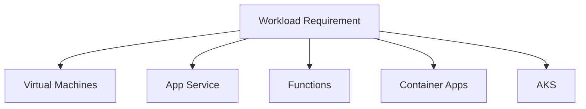

# 🧱 Virtualization and Azure

Virtualization is the foundation for cloud compute. Azure abstracts physical hardware into virtual machines, disks, networks, containers, serverless platforms, and managed services.

## Azure virtualization layers

- **Virtual machines:** Full OS control for Windows and Linux.
- **VM Scale Sets:** Repeatable VM fleets with autoscale.
- **Containers:** Azure Container Apps, AKS, and Azure Container Instances.
- **Serverless:** Azure Functions and Logic Apps.
- **Hybrid:** Azure Arc and Azure Stack HCI bring Azure management to non-Azure infrastructure.

## Why it matters

- Faster provisioning than physical servers.
- Better utilization through elastic scaling.
- Stronger isolation through subscriptions, VNets, NSGs, and identities.
- Automation through templates, pipelines, and policy.

## Best practices

- Choose the highest-level service that satisfies requirements.
- Use managed services when operations overhead is not a business differentiator.
- Design for zones, backups, monitoring, and disaster recovery from the start.

## Azure-first deep dive

Azure virtualization is not only VMs. It includes VM Scale Sets for fleets, App Service for managed web hosting, Functions for event-driven code, Container Apps for serverless containers, AKS for Kubernetes, and Azure Arc for extending Azure management outside Azure.

Pick the least operationally complex platform that meets the requirement. If you only need to run code on HTTP events, avoid a VM. If you need OS-level control, choose a VM. If you need Kubernetes APIs and ecosystem control, choose AKS.

## Practical architecture diagram

Practical lab: classify five sample workloads and choose VM, App Service, Functions, Container Apps, or AKS based on control, scale, runtime, and operations needs.
